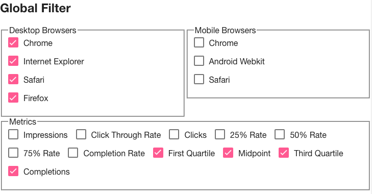
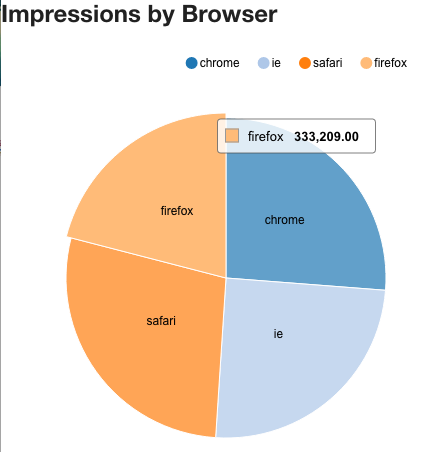
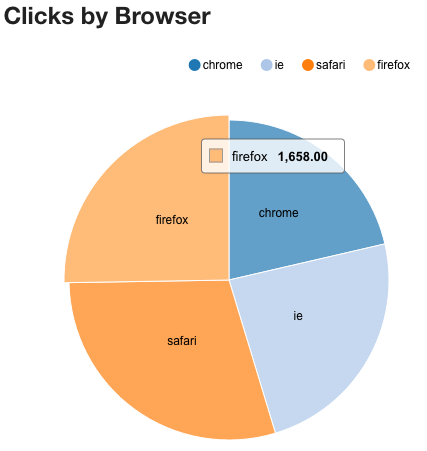

VideoAmp Front-End Challenge
----

This project is intended to be forked and completed by people applying for front-end and/or full-stack developer positions at VideoAmp. The purpose of this challenge is not necessarily to give a pass/fail to applicants. Instead, it will help us gauge an applicants coding skill level and style, as well as their comprehension and innovation of developing an application with constrained and limited specifications and resources.

## Key Notes

The follow notes are needed to be known to properly accomplish the tasks defined in the next section

### Data Mapping and Formatting
When displaying data, they need be transformed into human-readable values unless directed otherwise in the tasks

| Data Key | Label | Format |
| -------- | ----- | ------ |
| date | Date | 2016-03-01T00:00:00.000Z => March 1, 2016 |
| impressions | Impressions | 123456 => 123,456 |
| ctr | Click Through Rate | 0.0000153 => 0.002% |
| clicks | Clicks | 123456 => 123,456 |
| firstQuartilePercent | 25% Rate | 0.1234 => 12% |
| midpointPercent | 50% Rate | 0.1234 => 12% |
| thirdQuartilePercent | 75% Rate | 0.1234 => 12% |
| completePercent | Completion Rate | 0.1234 => 12% |
| firstQuartileImpressions | First Quartile | 123456 => 123,456 |
| midpointImpressions | Midpoint | 123456 => 123,456 |
| thirdQuartileImpressions | Third Quartile | 123456 => 123,456 |
| completeImpressions | Completions | 123456 => 123,456 |


### Platform and Browsers Mapping
Much like data keys, browsers need to be displayed as human-readable values. Additionally, browsers are specific to a device platform: desktop or mobile

| Browser Key | Label | Platform |
| ------------- | ----- | -------- |
| chrome | Chrome | Desktop |
| ie | Internet Explorer | Desktop |
| safari | Safari | Desktop |
| firefox | Firefox | Desktop |
| chrome-mobile | Chrome | Mobile |
| androidwebkit | Android Webkit | Mobile |
| mobile-safari | Safari | Mobile |


### Percent Value Aggregation
When aggregating percentage values, they need to be recalculated against total impressions for the dimensions; not summed up.

Example:

| Date | Impressions | Clicks | CTR |
|----- | ----------- | ------ | --- |
| March 1 | 10,000 | 5 | 0.050% |
| March 2 | 20,000 | 7 | 0.035% |
| **Total** | *30,000* | *12* | *0.040%* | 

Percent Values are calculated as:

| Key | Formula |
| --- | ------- |
| firstQuartilePercent | `firstQuartileImpressions / impressions` |
| midpointPercent | `midpointImpressions / impressions` |
| thirdQuartilePercent | `thirdQuartileImpressions / impressions` |
| completePercent | `completeImpressions / impressions` |
| ctr | `clicks / impressions` |


## MockAPI Service

A service called `MockAPI` is available for use to get the data for all the directives below. However, absolutely no changes are to be made to this service! This service has one fuction, `get` and accepts one argument which is expected to be an object with a single key/value pair of `browser` as an array. Refer to Platform and Browsers Mapping for the list of allowed values for this array. You are welcome and encouraged to look at the service but you cannot modify it.

The data returned is a collection of the following object model:

```
{
    "browser": String,
    "date": String,
    "impressions": Number,
    "ctr": Number,
    "clicks": Number,
    "firstQuartilePercent": Number,
    "midpointPercent": Number,
    "thirdQuartilePercent": Number,
    "completePercent": Number,
    "firstQuartileImpressions": Number,
    "midpointImpressions": Number,
    "thirdQuartileImpressions": Number,
    "completeImpressions": Number
}
```


## Getting Started


### Basic Rules and Guidelines

* You are encouraged to check out the pre-defined JavaScript, LESS, and HTML files through out the app to help you accomplish the challenge
* An `.eslintrc` file is available to to help validate code style and linting as a conveience. When running `gulp serve`, your code will be linted on every auto-reload and report any errors in your terminal. Passing the linting step is *not a requirement* to pass this challenge
    * We loosly follow [AirBnB's style guide](https://github.com/airbnb/javascript)
    * as well as [John Papa's angular style guide](https://github.com/johnpapa/angular-styleguide/tree/master/a1)
    * The linter is setup to adhere to those style guides, with minor tweaks for VideoAmp (double quotes vs single, 4 vs 2 spaces/tabs)
* All controllers should use isloated scopes thru the use of `controllerAs` syntax
* Styling the app through the use of LESS/CSS and/or Angular-Material is not a requirement but you are more than welcome to do so
* It is recommended you do not install/uninstall any bower or node modules other than the ones provided, but it is not required (ie penalized) if you do or don't. Just be prepared to code comment and talk about it during the review phase to explain your reasonings
* All the directives should be in a single view (eg. index.html) - there is no need to worry about URL routing
* Running and creating E2E and Unit tests are not part of this challenge, despite the fact that the testing framework exists.
* You do not need to run the build step to complete this challenge as we want to see your unminified code!
* It is highly encouraged for you to add code comments anywhere and everywhere for any reason, such as explaining why you did something or if you did not understand why something does not work, etc. It will help us understand what your throught process is and give us points to discuss during the review phase
    * Additionally, feel free to email [Walter Mazza](mailto:walter@videoamp.com) if you have any questions, comments, feedback, etc during the challenge!
* Lastly, remember this challenge is not necessarily a pass/fail test! We are simply gauging your knowledge and expertise. Feel free to build some parts, build all, or go above and beyond!


### Setup

1. To begin, fork this repo into your own GitHub account (if you do not have one, please create one)
2. Once forked, clone to your development machine/environment and install the necessary dependencies
    * Make sure to have the latest version of Node, NPM, and Bower installed before running the following commands
        * `npm install`
        * `bower install`
3. To run the application, use the command `gulp serve`
4. Make sure to commit your changes to YOUR repo and submit the link to your YOUR repo when done.
    * Feel free to follow your own git flow/commit method, we do no judge on that. But it is recommended to make constant commits as it can help us during the review phase to discuss how you went from A to B


## Tasks


### Directive: Global Filter

* Create a directive that displays all possible browsers (grouped by platform) and metrics
* Selecting/deselecting these filters should update all other directives as required by the directive
* When selecting browsers, the following rules need to be followed
     * When everything is selected, send an empty array to the Mock API for the `browser` param
     * When nothing is sleected, send an empty array to the Mock API for the `browser` param
     * Metrics are not sent to API but filtered client-side

#### Example



### Directive: Metrics Over Time

* Create a directive that displays selected metric(s) from the global filter as a time-series line chart using D3 or D3+NVD3
* Y-Axis represents the selected metric(s)
* X-Axis represents the date but formatted as "{Abbreviated Month} {Day}" (eg. "Mar 1")
* Do not display any of the percent-based metrics (eg. `ctr`, `firstQuartilePercent`, etc)

#### Example


### Directive: Impressions by Browser

* Create a directive that displays impressions by selected browser(s) from the global filter as a pie chart using D3 or D3+NVD3
* Browsers listed must match the browsers selected in the global filter

#### Example



### Directive: Clicks by Browser

* Create a directive that displays clicks by selected browser(s) from the global filter as a pie chart using D3 or D3+NVD3
* Browsers listed must match the browsers selected in the global filter

#### Example




### Directive: Data Table

* Create a directive that displays a table with grouped/nested rows
    * Group rows by date, sorted in ascending order (eg. Mar 1 to March 31)
    * Nested rows in group is selected browser(s) from the global filter
    * Columns represent all available metrics, regardless of what metrics are selected in the global filter
* The initial view must contain the following columns at all times in this order
    * Date
    * Browser
    * Platform
    * Impressions
    * Click Through Rate displayed as "CTR"
    * Completion Rate
* User is able to show/hide any other metric, independent of the global filter
    * Additional columns must appear after the initial columns
    * Order of additional columns should be
        * Clicks
        * Completions
        * First Quartile
        * 25% Rate
        * Midpoint
        * 50% Rate
        * Third Quartile
        * 75% Rate
* The grouping row must contain the proper aggregated values of its nested rows
* Table must include a totals footer row containing the proper aggregated values
* Column sorting is not required

#### Example
| Date | Browser | Platform | Impressions | CTR | Completion Rate |
| ---- | ------- | -------- | ----------- | --- | --------------- |
| March 1, 2016 | | | 50,000 | 0.360% | 90% |
| | Chrome | Desktop | 25,000 | 0.300% | 86% |
| | Internet Explorer | Desktop | 10,000 | 0.450% | 85% |
| | Safari | Mobile | 15,000 | 0.230% | 83% |
| March 31, 2016 | | | 50,000 | 0.360% | 90% |
| | Chrome | Desktop | 25,000 | 0.300% | 86% |
| | Internet Explorer | Desktop | 10,000 | 0.450% | 85% |
| | Safari | Mobile | 15,000 | 0.230% | 83% |
| **Totals** | | | **100,000** | **0.360%** | **90%** |
